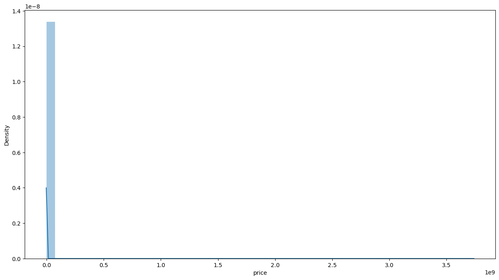
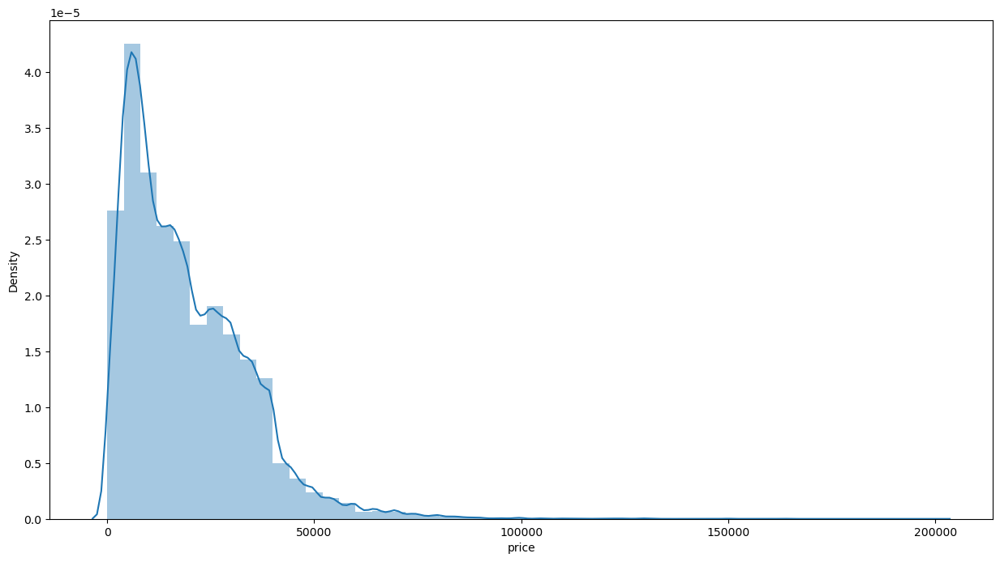
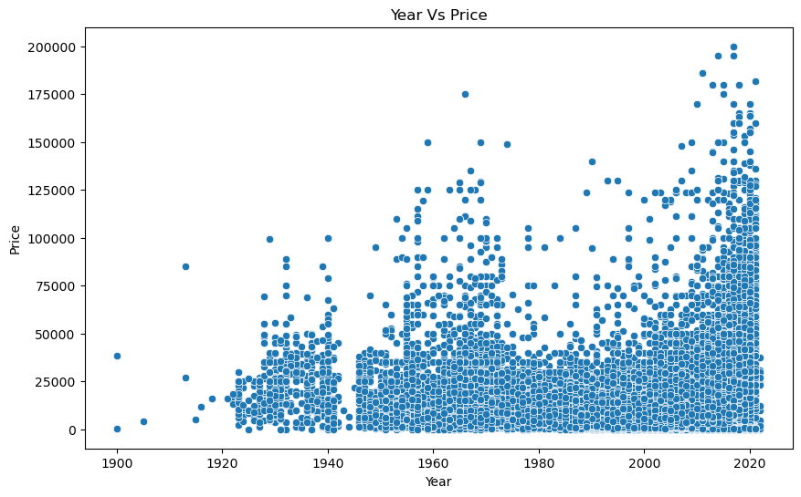
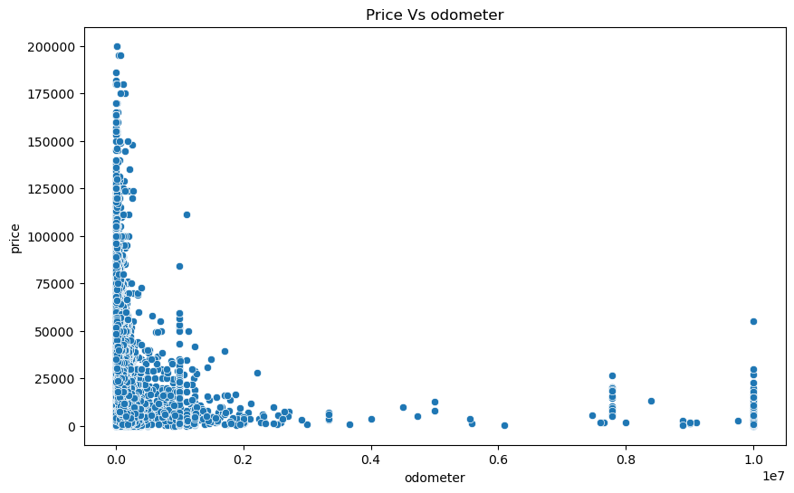
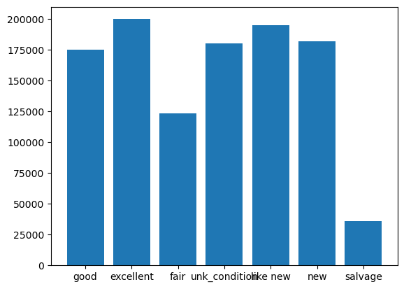
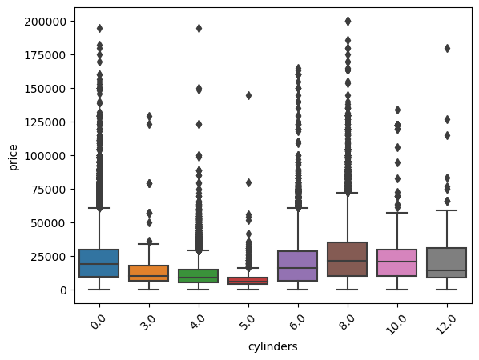
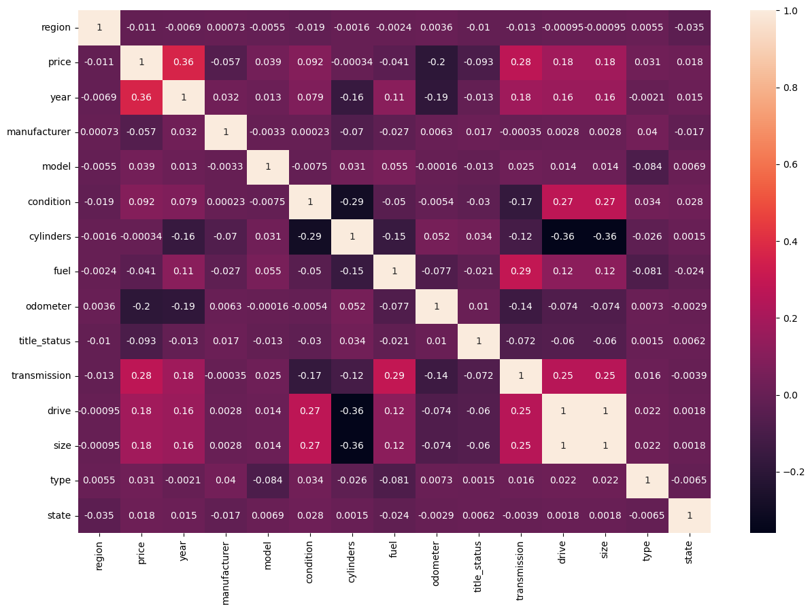
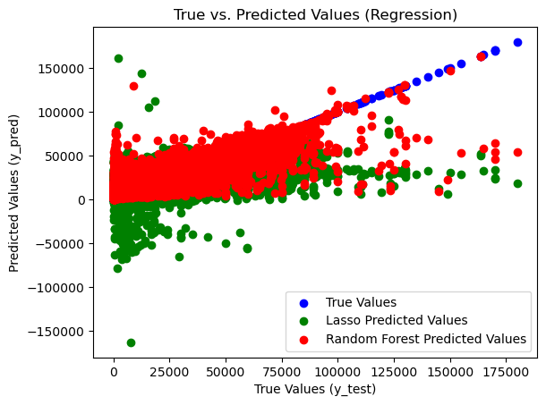

# What drives the price of a car?


**OVERVIEW**

In this application, you will explore a dataset from kaggle. The original dataset contained information on 3 million used cars. The provided dataset contains information on 426K cars to ensure speed of processing.  Your goal is to understand what factors make a car more or less expensive.  As a result of your analysis, you should provide clear recommendations to your client -- a used car dealership -- as to what consumers value in a used car.

### CRISP-DM Framework

<center>
    
</center>


To frame the task, throughout our practical applications we will refer back to a standard process in industry for data projects called CRISP-DM.  This process provides a framework for working through a data problem.  Your first step in this application will be to read through a brief overview of CRISP-DM [here](https://mo-pcco.s3.us-east-1.amazonaws.com/BH-PCMLAI/module_11/readings_starter.zip).  After reading the overview, answer the questions below.

### Business Understanding

From a business perspective, we are tasked with identifying key drivers for used car prices.  In the CRISP-DM overview, we are asked to convert this business framing to a data problem definition.  Using a few sentences, reframe the task as a data task with the appropriate technical vocabulary. 


```python
import pandas as pd
```


```python
vehicle_ds = pd.read_csv('data/vehicles.csv')
print(vehicle_ds.info())
```

    <class 'pandas.core.frame.DataFrame'>
    RangeIndex: 426880 entries, 0 to 426879
    Data columns (total 18 columns):
     #   Column        Non-Null Count   Dtype  
    ---  ------        --------------   -----  
     0   id            426880 non-null  int64  
     1   region        426880 non-null  object 
     2   price         426880 non-null  int64  
     3   year          425675 non-null  float64
     4   manufacturer  409234 non-null  object 
     5   model         421603 non-null  object 
     6   condition     252776 non-null  object 
     7   cylinders     249202 non-null  object 
     8   fuel          423867 non-null  object 
     9   odometer      422480 non-null  float64
     10  title_status  418638 non-null  object 
     11  transmission  424324 non-null  object 
     12  VIN           265838 non-null  object 
     13  drive         296313 non-null  object 
     14  size          120519 non-null  object 
     15  type          334022 non-null  object 
     16  paint_color   296677 non-null  object 
     17  state         426880 non-null  object 
    dtypes: float64(2), int64(2), object(14)
    memory usage: 58.6+ MB
    None


<p style="color: purple;font-bold:true">
    Vehicle dataset has yearly price of the various used cars. 
    <li style="color: purple;font-bold:true">
  Business requirement is to analyze the data and find the important features that affects the vehicle price</li>
<li style="color: purple;font-bold:true"> Create a model to predict the prize of the used cars based on the historical data given in the dataset</li>
</p>


```python

```

### Data Understanding

After considering the business understanding, we want to get familiar with our data.  Write down some steps that you would take to get to know the dataset and identify any quality issues within.  Take time to get to know the dataset and explore what information it contains and how this could be used to inform your business understanding.

<p style="color: purple;font-bold:true">From the previous step, we can say that the dataset has a lot of null values which needs to be cleaned before the analysis.</p>


```python
for cols in vehicle_ds.columns:
    print('Unique values in ',cols)
    print(vehicle_ds[cols].unique())
```

    Unique values in  id
    [7222695916 7218891961 7221797935 ... 7301591147 7301591140 7301591129]
    Unique values in  region
    ['prescott' 'fayetteville' 'florida keys' 'worcester / central MA'
     'greensboro' 'hudson valley' 'medford-ashland' 'erie' 'el paso'
     'bellingham' 'skagit / island / SJI' 'la crosse' 'auburn' 'birmingham'
     'dothan' 'florence / muscle shoals' 'gadsden-anniston'
     'huntsville / decatur' 'mobile' 'montgomery' 'tuscaloosa'
     'anchorage / mat-su' 'fairbanks' 'kenai peninsula' 'southeast alaska'
     'flagstaff / sedona' 'mohave county' 'phoenix' 'show low' 'sierra vista'
     'tucson' 'yuma' 'fort smith' 'jonesboro' 'little rock' 'texarkana'
     'bakersfield' 'chico' 'fresno / madera' 'gold country' 'hanford-corcoran'
     'humboldt county' 'imperial county' 'inland empire' 'los angeles'
     'mendocino county' 'merced' 'modesto' 'monterey bay' 'orange county'
     'palm springs' 'redding' 'reno / tahoe' 'sacramento' 'san diego'
     'san luis obispo' 'santa barbara' 'santa maria' 'SF bay area'
     'siskiyou county' 'stockton' 'susanville' 'ventura county'
     'visalia-tulare' 'yuba-sutter' 'boulder' 'colorado springs' 'denver'
     'eastern CO' 'fort collins / north CO' 'high rockies' 'pueblo'
     'western slope' 'eastern CT' 'hartford' 'new haven' 'northwest CT'
     'washington, DC' 'delaware' 'daytona beach' 'ft myers / SW florida'
     'gainesville' 'heartland florida' 'jacksonville' 'lakeland'
     'north central FL' 'ocala' 'okaloosa / walton' 'orlando' 'panama city'
     'pensacola' 'sarasota-bradenton' 'south florida' 'space coast'
     'st augustine' 'tallahassee' 'tampa bay area' 'treasure coast' 'albany'
     'athens' 'atlanta' 'augusta' 'brunswick' 'columbus'
     'macon / warner robins' 'northwest GA' 'savannah / hinesville'
     'statesboro' 'valdosta' 'hawaii' 'boise' 'east idaho'
     'lewiston / clarkston' 'pullman / moscow' "spokane / coeur d'alene"
     'twin falls' 'bloomington-normal' 'champaign urbana' 'chicago' 'decatur'
     'la salle co' 'mattoon-charleston' 'peoria' 'quad cities, IA/IL'
     'rockford' 'southern illinois' 'springfield' 'st louis, MO' 'western IL'
     'bloomington' 'evansville' 'fort wayne' 'indianapolis' 'kokomo'
     'lafayette / west lafayette' 'muncie / anderson' 'richmond'
     'south bend / michiana' 'terre haute' 'ames' 'cedar rapids' 'des moines'
     'dubuque' 'fort dodge' 'iowa city' 'mason city' 'omaha / council bluffs'
     'sioux city' 'southeast IA' 'waterloo / cedar falls' 'kansas city, MO'
     'lawrence' 'manhattan' 'northwest KS' 'salina' 'southeast KS'
     'southwest KS' 'topeka' 'wichita' 'bowling green' 'eastern kentucky'
     'huntington-ashland' 'lexington' 'louisville' 'owensboro' 'western KY'
     'baton rouge' 'central louisiana' 'houma' 'lafayette' 'lake charles'
     'monroe' 'new orleans' 'shreveport' 'maine' 'annapolis' 'baltimore'
     'cumberland valley' 'eastern shore' 'frederick' 'southern maryland'
     'western maryland' 'boston' 'cape cod / islands' 'south coast'
     'western massachusetts' 'ann arbor' 'battle creek' 'central michigan'
     'detroit metro' 'flint' 'grand rapids' 'holland' 'jackson' 'kalamazoo'
     'lansing' 'muskegon' 'northern michigan' 'port huron'
     'saginaw-midland-baycity' 'southwest michigan' 'the thumb'
     'upper peninsula' 'bemidji' 'brainerd' 'duluth / superior'
     'fargo / moorhead' 'mankato' 'minneapolis / st paul' 'rochester'
     'southwest MN' 'st cloud' 'gulfport / biloxi' 'hattiesburg' 'meridian'
     'north mississippi' 'southwest MS' 'columbia / jeff city' 'joplin'
     'kansas city' 'kirksville' 'lake of the ozarks' 'southeast missouri'
     'st joseph' 'st louis' 'billings' 'bozeman' 'butte' 'eastern montana'
     'great falls' 'helena' 'kalispell' 'missoula' 'asheville' 'boone'
     'charlotte' 'eastern NC' 'hickory / lenoir' 'outer banks'
     'raleigh / durham / CH' 'wilmington' 'winston-salem' 'grand island'
     'lincoln' 'north platte' 'scottsbluff / panhandle' 'elko' 'las vegas'
     'central NJ' 'jersey shore' 'north jersey' 'south jersey' 'albuquerque'
     'clovis / portales' 'farmington' 'las cruces' 'roswell / carlsbad'
     'santa fe / taos' 'binghamton' 'buffalo' 'catskills' 'chautauqua'
     'elmira-corning' 'finger lakes' 'glens falls' 'ithaca' 'long island'
     'new york city' 'oneonta' 'plattsburgh-adirondacks'
     'potsdam-canton-massena' 'syracuse' 'twin tiers NY/PA'
     'utica-rome-oneida' 'watertown' 'new hampshire' 'bismarck' 'grand forks'
     'north dakota' 'akron / canton' 'ashtabula' 'chillicothe' 'cincinnati'
     'cleveland' 'dayton / springfield' 'lima / findlay' 'mansfield'
     'northern panhandle' 'parkersburg-marietta' 'sandusky' 'toledo'
     'tuscarawas co' 'youngstown' 'zanesville / cambridge' 'fort smith, AR'
     'lawton' 'northwest OK' 'oklahoma city' 'stillwater' 'texoma' 'tulsa'
     'bend' 'corvallis/albany' 'east oregon' 'eugene' 'klamath falls'
     'oregon coast' 'portland' 'roseburg' 'salem' 'altoona-johnstown'
     'harrisburg' 'lancaster' 'lehigh valley' 'meadville' 'philadelphia'
     'pittsburgh' 'poconos' 'reading' 'scranton / wilkes-barre'
     'state college' 'williamsport' 'york' 'rhode island' 'charleston'
     'columbia' 'florence' 'greenville / upstate' 'hilton head' 'myrtle beach'
     'northeast SD' 'pierre / central SD' 'rapid city / west SD'
     'sioux falls / SE SD' 'south dakota' 'chattanooga' 'clarksville'
     'cookeville' 'knoxville' 'memphis' 'nashville' 'tri-cities' 'abilene'
     'amarillo' 'austin' 'beaumont / port arthur' 'brownsville'
     'college station' 'corpus christi' 'dallas / fort worth'
     'deep east texas' 'del rio / eagle pass' 'galveston' 'houston'
     'killeen / temple / ft hood' 'laredo' 'lubbock' 'mcallen / edinburg'
     'odessa / midland' 'san angelo' 'san antonio' 'san marcos' 'southwest TX'
     'tyler / east TX' 'victoria' 'waco' 'wichita falls' 'logan'
     'ogden-clearfield' 'provo / orem' 'salt lake city' 'st george' 'vermont'
     'charlottesville' 'danville' 'fredericksburg' 'harrisonburg' 'lynchburg'
     'new river valley' 'norfolk / hampton roads' 'roanoke' 'southwest VA'
     'winchester' 'kennewick-pasco-richland' 'moses lake' 'olympic peninsula'
     'seattle-tacoma' 'wenatchee' 'yakima' 'eastern panhandle' 'morgantown'
     'southern WV' 'west virginia (old)' 'appleton-oshkosh-FDL' 'eau claire'
     'green bay' 'janesville' 'kenosha-racine' 'madison' 'milwaukee'
     'northern WI' 'sheboygan' 'wausau' 'wyoming']
    Unique values in  price
    [ 6000 11900 21000 ...  6328 19853 17873]
    Unique values in  year
    [  nan 2014. 2010. 2020. 2017. 2013. 2012. 2016. 2019. 2011. 1992. 2018.
     2004. 2015. 2001. 2006. 1968. 2003. 2008. 2007. 2005. 1966. 2009. 1998.
     2002. 1999. 2021. 1997. 1976. 1969. 1995. 1978. 1954. 1979. 1970. 1974.
     1996. 1987. 2000. 1955. 1960. 1991. 1972. 1988. 1994. 1929. 1984. 1986.
     1989. 1973. 1946. 1933. 1958. 1937. 1985. 1957. 1953. 1942. 1963. 1977.
     1993. 1903. 1990. 1965. 1982. 1948. 1983. 1936. 1932. 1951. 1931. 1980.
     1967. 1971. 1947. 1981. 1926. 1962. 1975. 1964. 1934. 1952. 1940. 1959.
     1950. 1930. 1956. 1922. 1928. 2022. 1901. 1941. 1924. 1927. 1939. 1923.
     1949. 1961. 1935. 1918. 1900. 1938. 1913. 1916. 1943. 1925. 1921. 1915.
     1945. 1902. 1905. 1920. 1944. 1910. 1909.]
    Unique values in  manufacturer
    [nan 'gmc' 'chevrolet' 'toyota' 'ford' 'jeep' 'nissan' 'ram' 'mazda'
     'cadillac' 'honda' 'dodge' 'lexus' 'jaguar' 'buick' 'chrysler' 'volvo'
     'audi' 'infiniti' 'lincoln' 'alfa-romeo' 'subaru' 'acura' 'hyundai'
     'mercedes-benz' 'bmw' 'mitsubishi' 'volkswagen' 'porsche' 'kia' 'rover'
     'ferrari' 'mini' 'pontiac' 'fiat' 'tesla' 'saturn' 'mercury'
     'harley-davidson' 'datsun' 'aston-martin' 'land rover' 'morgan']
    Unique values in  model
    [nan 'sierra 1500 crew cab slt' 'silverado 1500' ... 'gand wagoneer'
     '96 Suburban' 'Paige Glenbrook Touring']
    Unique values in  condition
    [nan 'good' 'excellent' 'fair' 'like new' 'new' 'salvage']
    Unique values in  cylinders
    [nan '8 cylinders' '6 cylinders' '4 cylinders' '5 cylinders' 'other'
     '3 cylinders' '10 cylinders' '12 cylinders']
    Unique values in  fuel
    [nan 'gas' 'other' 'diesel' 'hybrid' 'electric']
    Unique values in  odometer
    [    nan  57923.  71229. ... 172511.  94964.  26892.]
    Unique values in  title_status
    [nan 'clean' 'rebuilt' 'lien' 'salvage' 'missing' 'parts only']
    Unique values in  transmission
    [nan 'other' 'automatic' 'manual']
    Unique values in  VIN
    [nan '3GTP1VEC4EG551563' '1GCSCSE06AZ123805' ... '2HGES15535H620534'
     '1FDWF37P64EA24868' 'SAJGX2749VCOO8376']
    Unique values in  drive
    [nan 'rwd' '4wd' 'fwd']
    Unique values in  size
    [nan 'full-size' 'mid-size' 'compact' 'sub-compact']
    Unique values in  type
    [nan 'pickup' 'truck' 'other' 'coupe' 'SUV' 'hatchback' 'mini-van' 'sedan'
     'offroad' 'bus' 'van' 'convertible' 'wagon']
    Unique values in  paint_color
    [nan 'white' 'blue' 'red' 'black' 'silver' 'grey' 'brown' 'yellow'
     'orange' 'green' 'custom' 'purple']
    Unique values in  state
    ['az' 'ar' 'fl' 'ma' 'nc' 'ny' 'or' 'pa' 'tx' 'wa' 'wi' 'al' 'ak' 'ca'
     'co' 'ct' 'dc' 'de' 'ga' 'hi' 'id' 'il' 'in' 'ia' 'ks' 'ky' 'la' 'me'
     'md' 'mi' 'mn' 'ms' 'mo' 'mt' 'ne' 'nv' 'nj' 'nm' 'nh' 'nd' 'oh' 'ok'
     'ri' 'sc' 'sd' 'tn' 'ut' 'vt' 'va' 'wv' 'wy']


<p style="color: purple;font-bold:true"> Here is the description of each column in vehicle dataset </p>
<li style="color: purple;font-bold:true"> id - Unique identifier of each row. DataType - Integer </li>
<li style="color: purple;font-bold:true"> region - The region where the sold the car. Datatype - String </li>
<li style="color: purple;font-bold:true"> price - price of the used car.This is the prediction field. Datatype - integer</li>
<li style="color: purple;font-bold:true"> year - Year Datatype- Float. Need to convert it to integer</li>
<li style="color: purple;font-bold:true">manufacturer- manufacturer of the car. Datatype-string</li>
<li style="color: purple;font-bold:true">model - model of the car. Datatype-string</li>
<li style="color: purple;font-bold:true">conditions - condition of the car.Datatype-string</li>
<li style="color: purple;font-bold:true">cylinders - No of cylinders in the car.Datatype-string</li>
<li style="color: purple;font-bold:true">fuel- gas,diesel,hybrid,electric.Datatype-string</li>
<li style="color: purple;font-bold:true">odometer- odometer reading. Datatype-integer</li>
<li style="color: purple;font-bold:true">title_status - title status.Datatype-string</li>
<li style="color: purple;font-bold:true">transmission - automatic or manual.Datatype-string</li>
<li style="color: purple;font-bold:true">vin - VIN number of the vehicle.VIN number is unique identifier of the vehicle. Datatype-string</li>
<li style="color: purple;font-bold:true">drive - rwd(real wheel drive),4wd(4 wheel drive),fwd(front wheel drive0.Datatype-string</li>
<li style="color: purple;font-bold:true">size- could be full-size, mid-size,compact,sub-compact.Datatype-string</li>
<li style="color: purple;font-bold:true">type. vehicle type. Datatype-string</li>
<li style="color: purple;font-bold:true">paint_color.color of the vehicle.Datatype-string</li>
<li style="color: purple;font-bold:true">state. state is the territory where the vehicle is sold.Represented in 2 letters.Datatype-string</li>
    

<p style="color: purple;font-bold:true">Data preparation should include</p>
<li style="color: purple;font-bold:true"> Identify null values</li>
<li style="color: purple;font-bold:true"> Replace or delete the null values</li>
<li style="color: purple;font-bold:true"> Identify the important feature</li>
<li style="color: purple;font-bold:true"> Normalize the dataset</li>

### Data Preparation

After our initial exploration and fine tuning of the business understanding, it is time to construct our final dataset prior to modeling.  Here, we want to make sure to handle any integrity issues and cleaning, the engineering of new features, any transformations that we believe should happen (scaling, logarithms, normalization, etc.), and general preparation for modeling with `sklearn`. 


```python
#Import the libraries
import seaborn as sns
import matplotlib.pyplot as plt
import numpy as np
from sklearn.preprocessing import LabelEncoder
import seaborn as sb 
from sklearn.preprocessing import StandardScaler, PolynomialFeatures
from sklearn.model_selection import train_test_split, GridSearchCV
from sklearn.ensemble import ExtraTreesRegressor, RandomForestRegressor
from sklearn.linear_model import LinearRegression, Ridge
from sklearn.tree import DecisionTreeRegressor
from sklearn import metrics
from sklearn.metrics import mean_squared_error, mean_absolute_error,accuracy_score
from sklearn.metrics import r2_score
import plotly.express as px
from sklearn.model_selection import KFold, cross_val_score
from numpy import sqrt
from sklearn.pipeline import Pipeline
from sklearn.feature_selection import SequentialFeatureSelector
```


```python
#Just to keep the row count lets replace the null values in the year to some random year.
#Here I am considering 1900
#vehicle_ds['year'] = vehicle_ds['year'].fillna('1900.0')
# This caused an error while trying to change the year 1900 to datetime.
#Removing the row which has null values in the year 
vehicle_ds.dropna(subset=['year'],inplace=True)
```


```python
#ID is not a valuable field for the anlaysis.Lets drop it
vehicle_ds = vehicle_ds.drop('id',axis=1)
```


```python
#Manufacturer of the car is the most valueable feature when buying the car.
#Lets drop the rows with null manufactures
vehicle_ds.dropna(subset=['manufacturer'],inplace=True)
vehicle_ds.info()
```

    <class 'pandas.core.frame.DataFrame'>
    Int64Index: 409228 entries, 27 to 426879
    Data columns (total 17 columns):
     #   Column        Non-Null Count   Dtype  
    ---  ------        --------------   -----  
     0   region        409228 non-null  object 
     1   price         409228 non-null  int64  
     2   year          409228 non-null  float64
     3   manufacturer  409228 non-null  object 
     4   model         404020 non-null  object 
     5   condition     241951 non-null  object 
     6   cylinders     239672 non-null  object 
     7   fuel          406675 non-null  object 
     8   odometer      405077 non-null  float64
     9   title_status  401479 non-null  object 
     10  transmission  406941 non-null  object 
     11  VIN           258100 non-null  object 
     12  drive         286066 non-null  object 
     13  size          115301 non-null  object 
     14  type          322856 non-null  object 
     15  paint_color   285076 non-null  object 
     16  state         409228 non-null  object 
    dtypes: float64(2), int64(1), object(14)
    memory usage: 56.2+ MB


```python
#Vin number is a unique identifier of the sold vehicles 
#This field is not needed for the analysis or prediction
vehicle_ds = vehicle_ds.drop('VIN',axis=1)
#Customers give less important to the car color when choosing a used car.
#We can remove it from the dataset
vehicle_ds = vehicle_ds.drop('paint_color',axis=1)
vehicle_ds.info()
```

    <class 'pandas.core.frame.DataFrame'>
    Int64Index: 409228 entries, 27 to 426879
    Data columns (total 15 columns):
     #   Column        Non-Null Count   Dtype  
    ---  ------        --------------   -----  
     0   region        409228 non-null  object 
     1   price         409228 non-null  int64  
     2   year          409228 non-null  float64
     3   manufacturer  409228 non-null  object 
     4   model         404020 non-null  object 
     5   condition     241951 non-null  object 
     6   cylinders     239672 non-null  object 
     7   fuel          406675 non-null  object 
     8   odometer      405077 non-null  float64
     9   title_status  401479 non-null  object 
     10  transmission  406941 non-null  object 
     11  drive         286066 non-null  object 
     12  size          115301 non-null  object 
     13  type          322856 non-null  object 
     14  state         409228 non-null  object 
    dtypes: float64(2), int64(1), object(12)
    memory usage: 50.0+ MB


```python
# replacing the empty models into unk_model
vehicle_ds['model'] = vehicle_ds['model'].fillna('unk_model')
# replacing the empty models into unk_condition
vehicle_ds['condition'] = vehicle_ds['condition'].fillna('unk_condition')
#replacing null cylinder value other
vehicle_ds['cylinders'] = vehicle_ds['cylinders'].fillna('0')
#convert the cylinders to float datatype
vehicle_ds['cylinders'] = vehicle_ds['cylinders'].replace('other','0')
vehicle_ds['cylinders'] = vehicle_ds['cylinders'].str.split(expand=True)[0].astype(float)
#Drop the row if null value in odometer
vehicle_ds.dropna(subset=['odometer'],inplace=True)
#replacing null fuel to other
vehicle_ds['fuel'] = vehicle_ds['fuel'].fillna('other')
#Drop the row if null value in title_status
vehicle_ds.dropna(subset=['title_status'],inplace=True)
#replacing null transmission to other
vehicle_ds['transmission'] = vehicle_ds['transmission'].fillna('other')
#replacing null type to other
vehicle_ds['type'] = vehicle_ds['type'].fillna('other')
#replacing null size to unk_size
vehicle_ds['size'] = vehicle_ds['size'].fillna('unk_size')
#replacing null size to unk_drive
vehicle_ds['drive'] = vehicle_ds['size'].fillna('unk_drive')
vehicle_ds.info()
```

    <class 'pandas.core.frame.DataFrame'>
    Int64Index: 397873 entries, 27 to 426879
    Data columns (total 15 columns):
     #   Column        Non-Null Count   Dtype  
    ---  ------        --------------   -----  
     0   region        397873 non-null  object 
     1   price         397873 non-null  int64  
     2   year          397873 non-null  float64
     3   manufacturer  397873 non-null  object 
     4   model         397873 non-null  object 
     5   condition     397873 non-null  object 
     6   cylinders     397873 non-null  float64
     7   fuel          397873 non-null  object 
     8   odometer      397873 non-null  float64
     9   title_status  397873 non-null  object 
     10  transmission  397873 non-null  object 
     11  drive         397873 non-null  object 
     12  size          397873 non-null  object 
     13  type          397873 non-null  object 
     14  state         397873 non-null  object 
    dtypes: float64(3), int64(1), object(11)
    memory usage: 48.6+ MB


```python
#Check for duplicate row
vehicle_ds.duplicated().sum()
vehicle_ds.drop_duplicates(inplace=True)
vehicle_ds.reset_index(drop=True, inplace=True)
vehicle_ds.duplicated().sum()
vehicle_ds.head()
```


<div>
<style scoped>
    .dataframe tbody tr th:only-of-type {
        vertical-align: middle;
    }

    .dataframe tbody tr th {
        vertical-align: top;
    }

    .dataframe thead th {
        text-align: right;
    }
</style>
<table border="1" class="dataframe">
  <thead>
    <tr style="text-align: right;">
      <th></th>
      <th>region</th>
      <th>price</th>
      <th>year</th>
      <th>manufacturer</th>
      <th>model</th>
      <th>condition</th>
      <th>cylinders</th>
      <th>fuel</th>
      <th>odometer</th>
      <th>title_status</th>
      <th>transmission</th>
      <th>drive</th>
      <th>size</th>
      <th>type</th>
      <th>state</th>
    </tr>
  </thead>
  <tbody>
    <tr>
      <th>0</th>
      <td>auburn</td>
      <td>33590</td>
      <td>2014.0</td>
      <td>gmc</td>
      <td>sierra 1500 crew cab slt</td>
      <td>good</td>
      <td>8.0</td>
      <td>gas</td>
      <td>57923.0</td>
      <td>clean</td>
      <td>other</td>
      <td>unk_size</td>
      <td>unk_size</td>
      <td>pickup</td>
      <td>al</td>
    </tr>
    <tr>
      <th>1</th>
      <td>auburn</td>
      <td>22590</td>
      <td>2010.0</td>
      <td>chevrolet</td>
      <td>silverado 1500</td>
      <td>good</td>
      <td>8.0</td>
      <td>gas</td>
      <td>71229.0</td>
      <td>clean</td>
      <td>other</td>
      <td>unk_size</td>
      <td>unk_size</td>
      <td>pickup</td>
      <td>al</td>
    </tr>
    <tr>
      <th>2</th>
      <td>auburn</td>
      <td>39590</td>
      <td>2020.0</td>
      <td>chevrolet</td>
      <td>silverado 1500 crew</td>
      <td>good</td>
      <td>8.0</td>
      <td>gas</td>
      <td>19160.0</td>
      <td>clean</td>
      <td>other</td>
      <td>unk_size</td>
      <td>unk_size</td>
      <td>pickup</td>
      <td>al</td>
    </tr>
    <tr>
      <th>3</th>
      <td>auburn</td>
      <td>30990</td>
      <td>2017.0</td>
      <td>toyota</td>
      <td>tundra double cab sr</td>
      <td>good</td>
      <td>8.0</td>
      <td>gas</td>
      <td>41124.0</td>
      <td>clean</td>
      <td>other</td>
      <td>unk_size</td>
      <td>unk_size</td>
      <td>pickup</td>
      <td>al</td>
    </tr>
    <tr>
      <th>4</th>
      <td>auburn</td>
      <td>15000</td>
      <td>2013.0</td>
      <td>ford</td>
      <td>f-150 xlt</td>
      <td>excellent</td>
      <td>6.0</td>
      <td>gas</td>
      <td>128000.0</td>
      <td>clean</td>
      <td>automatic</td>
      <td>full-size</td>
      <td>full-size</td>
      <td>truck</td>
      <td>al</td>
    </tr>
  </tbody>
</table>
</div>


```python
#Converting year into datetime
vehicle_ds['year'] = vehicle_ds['year'].astype('int')
#vehicle_ds['year'] = pd.to_datetime(vehicle_ds['year'] , format='%Y')
vehicle_ds['price'].mean()
vehicle_ds['price'].min()
vehicle_ds['price'].max()
```


    3736928711


```python
# plotting target value- price

f, ax = plt.subplots(figsize=(15,8))
sns.distplot(vehicle_ds['price'])
print("Skewness:", vehicle_ds['price'].skew())
print("Kurtosis:", vehicle_ds['price'].kurt())
```

    /var/folders/6k/9yqvqnzj7ks2p88hgpv79s0r0000gq/T/ipykernel_36645/678605540.py:4: UserWarning: 
    
    `distplot` is a deprecated function and will be removed in seaborn v0.14.0.
    
    Please adapt your code to use either `displot` (a figure-level function with
    similar flexibility) or `histplot` (an axes-level function for histograms).
    
    For a guide to updating your code to use the new functions, please see
    https://gist.github.com/mwaskom/de44147ed2974457ad6372750bbe5751
    
      sns.distplot(vehicle_ds['price'])


    Skewness: 229.1928727882703
    Kurtosis: 56141.38561101271


    

    


```python
#Price looks skewed. Lets remove the outliers and keep the price between 0 and 200000
vehicle_ds_1 = vehicle_ds.query('price < 200000 and price > 10')
f, ax = plt.subplots(figsize=(15,8))
sns.distplot(vehicle_ds_1['price'])
```

    /var/folders/6k/9yqvqnzj7ks2p88hgpv79s0r0000gq/T/ipykernel_36645/903696178.py:4: UserWarning: 
    
    `distplot` is a deprecated function and will be removed in seaborn v0.14.0.
    
    Please adapt your code to use either `displot` (a figure-level function with
    similar flexibility) or `histplot` (an axes-level function for histograms).
    
    For a guide to updating your code to use the new functions, please see
    https://gist.github.com/mwaskom/de44147ed2974457ad6372750bbe5751
    
      sns.distplot(vehicle_ds_1['price'])


    <Axes: xlabel='price', ylabel='Density'>


    

    


```python
#Removing outliers based on the quantile
for col in ['price','odometer','cylinders']:
    Q1 = vehicle_ds[col].quantile(0.25)
    Q3 = vehicle_ds[col].quantile(0.75)
    IQR = Q3 - Q1
    lower_bound = Q1 - 2.5*IQR
    upper_bound = Q3 + 2.5*IQR
    vehicle_ds_2 = vehicle_ds[(vehicle_ds[col] >= lower_bound) & (vehicle_ds[col] <= upper_bound)]
```


```python

f, ax = plt.subplots(figsize=(15,8))
sns.distplot(vehicle_ds_2['price'])
```

    /var/folders/6k/9yqvqnzj7ks2p88hgpv79s0r0000gq/T/ipykernel_36645/4202918668.py:2: UserWarning: 
    
    `distplot` is a deprecated function and will be removed in seaborn v0.14.0.
    
    Please adapt your code to use either `displot` (a figure-level function with
    similar flexibility) or `histplot` (an axes-level function for histograms).
    
    For a guide to updating your code to use the new functions, please see
    https://gist.github.com/mwaskom/de44147ed2974457ad6372750bbe5751
    
      sns.distplot(vehicle_ds_2['price'])


    <Axes: xlabel='price', ylabel='Density'>


    

    


<p style="color: purple;font-bold:true">Using quantiles does not help with removing the outliers. Lets proceed with the price between 10 and 200000</p>


```python
vehicle_ds_1.info()

```

    <class 'pandas.core.frame.DataFrame'>
    Int64Index: 321541 entries, 0 to 345962
    Data columns (total 15 columns):
     #   Column        Non-Null Count   Dtype  
    ---  ------        --------------   -----  
     0   region        321541 non-null  object 
     1   price         321541 non-null  int64  
     2   year          321541 non-null  int64  
     3   manufacturer  321541 non-null  object 
     4   model         321541 non-null  object 
     5   condition     321541 non-null  object 
     6   cylinders     321541 non-null  float64
     7   fuel          321541 non-null  object 
     8   odometer      321541 non-null  float64
     9   title_status  321541 non-null  object 
     10  transmission  321541 non-null  object 
     11  drive         321541 non-null  object 
     12  size          321541 non-null  object 
     13  type          321541 non-null  object 
     14  state         321541 non-null  object 
    dtypes: float64(2), int64(2), object(11)
    memory usage: 39.3+ MB


```python

```


```python
#charting price vs year
plt.figure(figsize=(10, 6))
sns.scatterplot(x='year', y='price', data=vehicle_ds_1)
plt.title('Year Vs Price')
plt.xlabel('Year')
plt.ylabel('Price')
plt.show()
```


    

    


<p style="color: purple;font-bold:true">More cars being sold with higher price as the year goes on</p>


```python
#charting price vs odometer
plt.figure(figsize=(10, 6))
sns.scatterplot(x='odometer', y='price', data=vehicle_ds_1)
plt.title('Price Vs odometer')
plt.xlabel('odometer')
plt.ylabel('price')
plt.show()
```


    

    


```python
plt.bar(vehicle_ds_1['condition'],vehicle_ds_1['price'])
plt.show()
```


    

    


<p style="color: purple;font-bold:true">Vehicle condition directly affect the price of the vehicle</p>


```python
fig, ax = plt.subplots()
sns.boxplot(x = 'cylinders', y = 'price', data = vehicle_ds_1,ax=ax) 
plt.xticks(rotation=45)
```


    (array([0, 1, 2, 3, 4, 5, 6, 7]),
     [Text(0, 0, '0.0'),
      Text(1, 0, '3.0'),
      Text(2, 0, '4.0'),
      Text(3, 0, '5.0'),
      Text(4, 0, '6.0'),
      Text(5, 0, '8.0'),
      Text(6, 0, '10.0'),
      Text(7, 0, '12.0')])


    

    


<p style="color: purple;font-bold:true"> Number of cylinders has positive relationship to the price</p>


```python
#Target Encoding of categorical data and feature selection
vehicle_encoded=vehicle_ds_1.copy()
for col in vehicle_encoded.select_dtypes(include='O').columns:
    le=LabelEncoder()
    vehicle_encoded[col]=le.fit_transform(vehicle_encoded[col])
```


```python

```


```python
#Heatmap on the encoded correlation data
plt.figure(figsize=(15, 10))
dataplot = sb.heatmap(vehicle_encoded.corr(),  annot=True) 

plt.show() 
```


    

    


```python
#Lets try the sequential feature selection with 5 features to select 
#from sklearn.naive_bayes import GaussianNB
                                                
# Create feature set (X) and target variable (y)
X = vehicle_encoded.drop('price', axis = 1)
y = vehicle_encoded['price']
X_train, X_test, y_train, y_test = train_test_split(X, y, test_size=0.2, random_state=42)

selector = SequentialFeatureSelector(LinearRegression() ,n_features_to_select=5, direction='forward', 
                                     scoring="neg_mean_squared_error", 
                                     cv=5)

selector.fit_transform(X_train,y_train)
feature_names = X.columns
feature_names[selector.get_support()]
```


    Index(['year', 'condition', 'fuel', 'odometer', 'transmission'], dtype='object')


<p style="color: purple;font-bold:true"> Heatmap shows positive correlations of the price with year,cylinders,transmission,drive,size</p>
<p style="color: purple;font-bold:true"> Sequential Selector picked year,cylinders,fuel,odometer and transmission as top 5 features 
    that affects the price</p>
<p style="color: purple;font-bold:true"> lets choose manufacturer,model,odometer,cylinders,fuel,transmission,size features for our modeling</p>

### Modeling

With your (almost?) final dataset in hand, it is now time to build some models.  Here, you should build a number of different regression models with the price as the target.  In building your models, you should explore different parameters and be sure to cross-validate your findings.


```python
vehicle_selected = vehicle_ds.copy()
vehicle_featured  = pd.DataFrame(vehicle_selected[['year','price','transmission','model','manufacturer',
                                                   'size','cylinders','odometer','fuel','state']])
for col in vehicle_featured.select_dtypes(include='O').columns:
        le=LabelEncoder()
        vehicle_featured[col]=le.fit_transform(vehicle_featured[col])
print(vehicle_featured.info())
# Create feature set (X) and target variable (y)
X = vehicle_featured.drop('price', axis = 1)
y = vehicle_featured['price']
print(X.info())
```

    <class 'pandas.core.frame.DataFrame'>
    RangeIndex: 345963 entries, 0 to 345962
    Data columns (total 10 columns):
     #   Column        Non-Null Count   Dtype  
    ---  ------        --------------   -----  
     0   year          345963 non-null  int64  
     1   price         345963 non-null  int64  
     2   transmission  345963 non-null  int64  
     3   model         345963 non-null  int64  
     4   manufacturer  345963 non-null  int64  
     5   size          345963 non-null  int64  
     6   cylinders     345963 non-null  float64
     7   odometer      345963 non-null  float64
     8   fuel          345963 non-null  int64  
     9   state         345963 non-null  int64  
    dtypes: float64(2), int64(8)
    memory usage: 26.4 MB
    None
    <class 'pandas.core.frame.DataFrame'>
    RangeIndex: 345963 entries, 0 to 345962
    Data columns (total 9 columns):
     #   Column        Non-Null Count   Dtype  
    ---  ------        --------------   -----  
     0   year          345963 non-null  int64  
     1   transmission  345963 non-null  int64  
     2   model         345963 non-null  int64  
     3   manufacturer  345963 non-null  int64  
     4   size          345963 non-null  int64  
     5   cylinders     345963 non-null  float64
     6   odometer      345963 non-null  float64
     7   fuel          345963 non-null  int64  
     8   state         345963 non-null  int64  
    dtypes: float64(2), int64(7)
    memory usage: 23.8 MB
    None


```python
#Splitting the dataset intoo training and test
X_train, X_test, y_train, y_test = train_test_split(X, y, test_size=0.2, random_state=1)
```


```python
#Lasso Model
from sklearn import linear_model
import math
lasso_pipe = Pipeline([('polyfeatures', PolynomialFeatures(degree = 3, include_bias = False)),
                      ('scaler', StandardScaler()),
                     ('lasso', linear_model.Lasso(random_state = 42))])
lasso_pipe.fit(X_train, y_train)
#lasso_coefs = lasso_pipe.named_steps['lasso'].coef_

y_pred_lasso = lasso_pipe.predict(X_test)
    
#Errors Metrics
mse = metrics.mean_squared_error(y_pred_lasso,y_test)
rmse = math.sqrt(mse)
mae = metrics.mean_absolute_error(y_pred_lasso,y_test)
print('Lasso model Mean Squared Error',mse)
print('Lasso model Root Mean Squared Error',rmse)
print('Lasso model Absolute Mean Error',mae)
print('Lasso Accuracy on testing data',lasso_pipe.score(X_test,y_test))
```

    /Users/johnsiraniperiandavar/anaconda3/lib/python3.11/site-packages/sklearn/linear_model/_coordinate_descent.py:628: ConvergenceWarning: Objective did not converge. You might want to increase the number of iterations, check the scale of the features or consider increasing regularisation. Duality gap: 2.641e+19, tolerance: 5.317e+15
      model = cd_fast.enet_coordinate_descent(


    Lasso model Mean Squared Error 148126417316374.16
    Lasso model Root Mean Squared Error 12170719.671259139
    Lasso model Absolute Mean Error 341609.96825448086
    Lasso Accuracy on testing data -0.009352422566107466


```python

random_forest = RandomForestRegressor()
random_forest.fit(X_train, y_train)
y_pred_rf = random_forest.predict(X_test)

    
#Errors Metrics
mse = metrics.mean_squared_error(y_pred_rf,y_test)
rmse = math.sqrt(mse)
mae = metrics.mean_absolute_error(y_pred_rf,y_test)
print('Random Forest Mean Squared Error',mse)
print('Random Forest Root Mean Squared Error',rmse)
print('Random Forest Absolute Mean Error',mae)
print('Random Forest Accuracy on testing data',random_forest.score(X_test,y_test))

```

    Random Forest Mean Squared Error 179410227135097.9
    Random Forest Root Mean Squared Error 13394410.294413783
    Random Forest Absolute Mean Error 135029.66624751122
    Random Forest Accuracy on testing data -0.22252431857020838


```python
true_color = 'b'  # Blue
pred_color = 'r'  # Red

plt.scatter(y_test, y_test, color=true_color, label='True Values')
plt.scatter(y_test, y_pred_lasso, color='g', label='Lasso Predicted Values')
plt.scatter(y_test, y_pred_rf, color=pred_color, label='Random Forest Predicted Values')
plt.xlabel("True Values (y_test)")
plt.ylabel("Predicted Values (y_pred)")
plt.title("True vs. Predicted Values (Regression)")

# Create a legend to label the points
plt.legend()
plt.show()

```


    

    


```python

```

### Evaluation

With some modeling accomplished, we aim to reflect on what we identify as a high quality model and what we are able to learn from this.  We should review our business objective and explore how well we can provide meaningful insight on drivers of used car prices.  Your goal now is to distill your findings and determine whether the earlier phases need revisitation and adjustment or if you have information of value to bring back to your client.

<p style="color: purple;font-bold:true">As the sequential features suggested the important features that drives the price of the car are year,cylinders,fuel,odometer and transmission.</p>
<p style="color: purple;font-bold:true"> We tried Lasso and Random forest to predict the price and compared it with the original sold price.
    Random forest prediction is better than lasso.</p>


```python

```


```python

```


```python

```


```python

```


```python

```

### Deployment

Now that we've settled on our models and findings, it is time to deliver the information to the client.  You should organize your work as a basic report that details your primary findings.  Keep in mind that your audience is a group of used car dealers interested in fine tuning their inventory.

<p  style="color: purple;font-bold:true">The features that positively affect price increase the most are:
    <li> odometer reading on the vehicle</li>
    <li> Vehicles with 8, 10, and 12 cyclinders tend to cost more</li>
    <li> Diesel fuel and electric vehicles tend to have higher prices</li>
    <li> vehicle in good condition tend to price more</li>
    <li> Used car prices increases by the year</li>
</p>

<p  style="color: purple;font-bold:true">
    <li>Next Step:</li>
    <li>1. Deploy the model</li>
    <li>2. Setup the process to monitor the performance of the model</li>
    <li>3. Tune the model for better performance as needed</li>
</p>


```python

```


```python

```


```python

```


```python

```


```python

```
